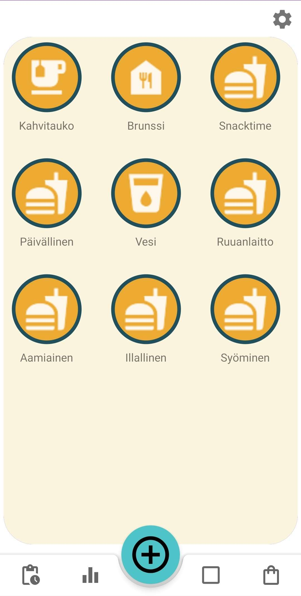
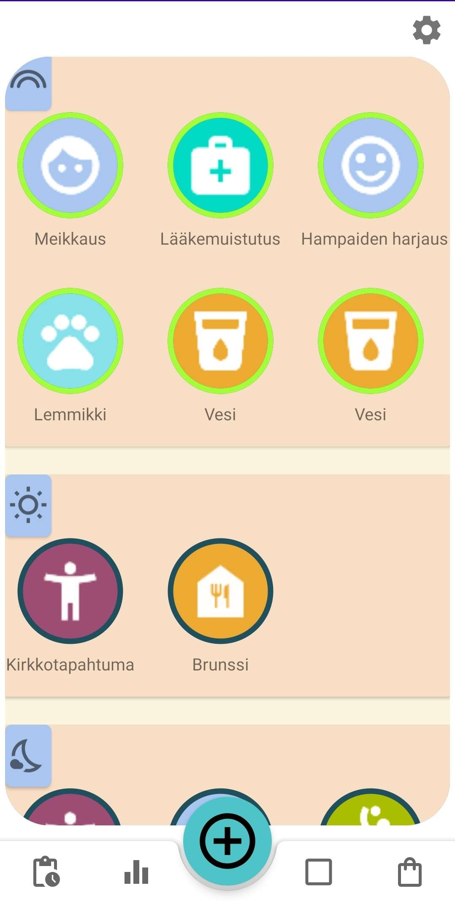
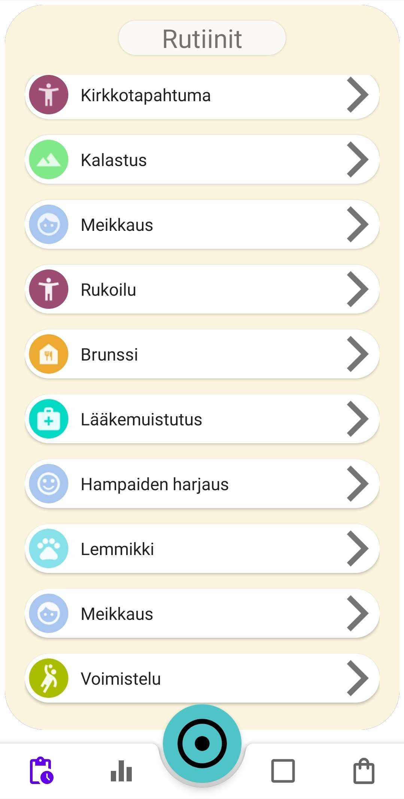
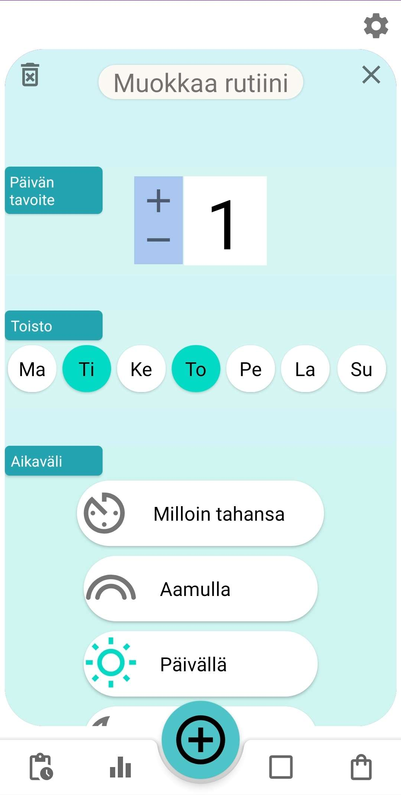
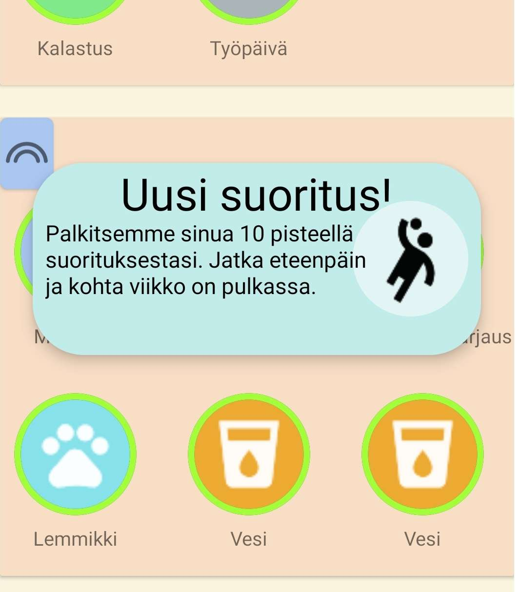
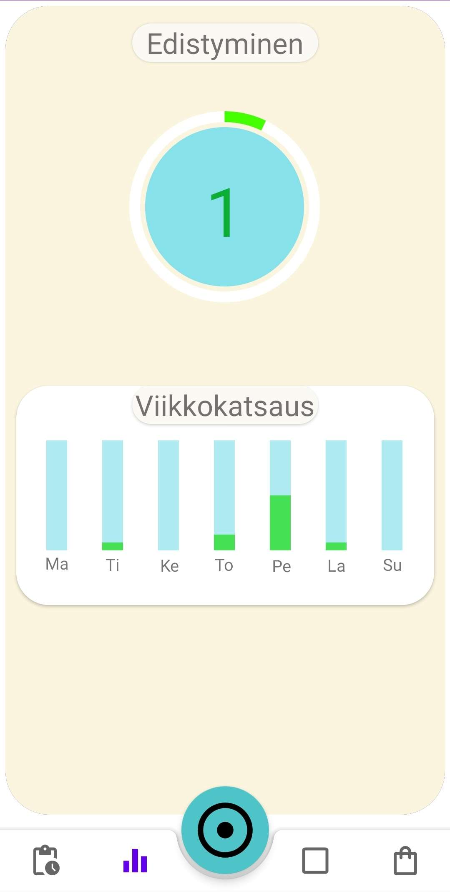

# DayMate Activity and Routine Monitor

#### Course project for Mobiilit Terveyssovellukset (Mobile Health Applications)

We developed an Android application that allows the user to record and schedule their daily routines and activities 
so that they can improve and facilitate their own time management. The application provides daily alerts
about important routines, like medicine dosage or hydration. The user receives points for succeeding tasks.

Daymate was designed for clinical and dementia patients, but during *Covid-19* pandemic it became a remote time scheduling project.

## Structure

The project follows a hybrid MVVM design pattern. **Logic** and **Views** are separated in **Presenter**, **UIView** Fragments and **ViewModels** respectively. The project root is **AppDataLogic** object.

* __AppDataLogic__: The global root class.
* __Presenter__: UI main class that attaches ViewModels via FactoryProviders.
* __UIView__: A Fragment that may attach to multiple ViewModels.
* __ViewModel__: Application logic class.

```md
team9.daymate
├── core
│   ├── AppDataLogic.java
│   ├── Presenter.java
│   └── UIView.java
│ 
├── routines 
│   ├── RoutineActivity.java (Presenter)
│   └── UIView Fragments
│ 
├── viewModels
│   └── . . . 
└── RouterActivity.java
```

## Prerequisites:

The application was entirely made in Android Studio 2020 with Java 17.

* `Android Studio 4.2`
* `Gradle Plugin 8.2`
* `JDK 17`
* `Android JUnit4`
* `Android Emulator (Pixel 4a)`


## Screenshots

<table>
  <tr>
  	<td align="center">
      
    </td>
     <td align="center">
      
    </td>
  </tr>
  <tr>
     <td align="center">
      
    </td>
    <td align="center">
      
    </td>
  </tr>
  <tr>
  	<td align="center">
      
    </td>
    <td align="center">
      
    </td>
  </tr>
</table>
